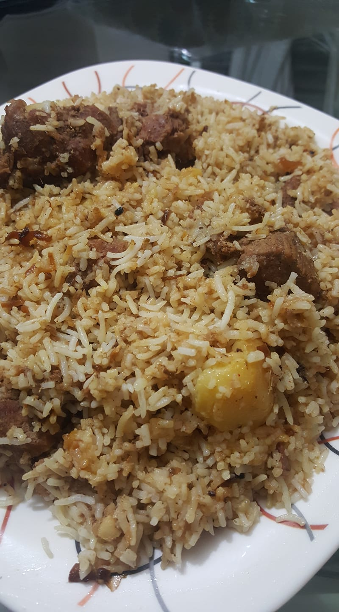

# 🖼️ image.html – Displaying Images in HTML

This file demonstrates how to insert and manage images in HTML using the `` tag. It includes examples of images from online sources, local folders, and different directory paths.

---

## 📅 Purpose of the File

To practice and showcase how images can be displayed using different methods: external URLs, local images, and images stored in subfolders.

---

## 📅 Tags Used

| Tag     | Description                                                                 |
|---------|-----------------------------------------------------------------------------|
| `` | Embeds an image in the web page. Requires `src` (source) and `alt` (alternative text) attributes. |
| `<br>`  | Inserts a line break to separate content vertically.                        |

---

## 🚀 Image Examples

### ✉️ Image from Online Source
```html


```
These images are loaded directly from the internet using image URLs.

---

### 📂 Image from Local Directory
```html

```
This loads an image from the root directory where the HTML file is saved.

---

### 🌐 Image from Subfolder
```html


```
These examples show how to reference images stored in nested folders and also how to control their size using the `height` and `width` attributes.

---

## ⚠️ Accessibility and Best Practices

- Always use the `alt` attribute for accessibility and better SEO.
- Large image sizes can slow down page load time. Use appropriate dimensions and image optimization.
- Use descriptive folder and file names for clarity and organization.

---

## 🔄 Summary

This file demonstrates multiple ways to include and manage images in a webpage using the `` tag. It also emphasizes good practices such as using `alt` attributes and organizing image paths.

---
